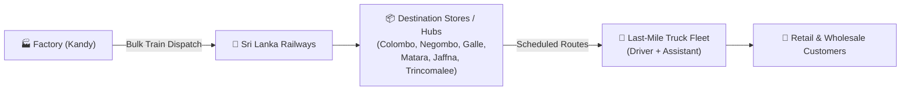

# 🚆 kandypack - Rail & Road-based Supply Chain Distribution System

[](https://www.python.org/)
[](https://streamlit.io/)
[](https://www.postgresql.org/)
[](https://www.docker.com/)

**kandypack** is an enterprise supply chain and database-driven logistics platform designed for a mid-sized FMCG manufacturing company based in Kandy, Sri Lanka. The platform manages island-wide multimodal distribution combining **bulk railway transit** with **road-based last-mile delivery**, backed by a PostgreSQL database and an interactive Streamlit management interface.

---

## 📋 Table of Contents

- [Business Domain & Logistics Workflow](#-business-domain--logistics-workflow)
- [Core Business Rules & Constraints](#-core-business-rules--constraints)
- [Management Reports](#-management-reports)
- [Key Features & Web Interface](#-key-features--web-interface)
- [Tech Stack](#-tech-stack)
- [Project Structure](#-project-structure)
- [Quick Start with Docker](#-quick-start-with-docker-recommended)
- [Local Development (Without Docker)](#-local-development-without-docker)
- [Environment Variables](#-environment-variables)
- [Database Management & Useful Commands](#-database-management--useful-commands)
- [License](#-license)

---

## 🏢 Business Domain & Logistics Workflow

Kandypack manufactures fast-moving consumer goods (FMCG) in Kandy and distributes them across Sri Lanka to wholesale and retail clients.



1. **Bulk Railway Transport**: Goods are shipped from Kandy via Sri Lanka Railways to key regional hub stations:
   - **Colombo**, **Negombo**, **Galle**, **Matara**, **Jaffna**, and **Trincomalee**.
2. **Intermediate Warehousing**: Goods are received, unloaded, and buffered at destination stores located adjacent to railway stations.
3. **Road Last-Mile Delivery**: Dedicated trucks execute predefined route deliveries from the stores to customer addresses within designated geographical service areas.

---

## ⚖️ Core Business Rules & Constraints

### 1. Rail Transport & Cargo Space Consumption
- **Train Capacities**: Fixed cargo capacity per train trip.
- **Space Consumption Rate**: Each product type has a defined space unit consumption rate (e.g., 1 box of detergent = 0.5 space units).
- **Rollover Scheduling**: If total order volume exceeds train capacity for a scheduled trip, excess inventory is rolled over and scheduled for the next available trip.

### 2. Orders & Advance Placement
- **Advance Booking**: Orders must be placed **at least 7 days in advance**.
- **Multi-Item Orders**: Orders contain multiple product items, quantities, and line-item details.
- **Route Matching**: Order delivery addresses are strictly mapped to the corresponding delivery route covering that area.
- **Lifecycle Tracking**: Delivery statuses are tracked through `Pending`, `Scheduled`, `In-Transit`, and `Delivered`.

### 3. Crew Scheduling & Labor Compliance
- **Crew Assignment**: Every truck delivery requires 1 Driver and 1 Driver Assistant.
- **Conflict Prevention**: No truck, driver, or assistant may have overlapping or conflicting delivery schedules.
- **Driver Roster Rules**:
  - Must **not** be scheduled for two consecutive truck deliveries.
  - Maximum **40 working hours per week**.
- **Driver Assistant Roster Rules**:
  - May be scheduled for a maximum of **two consecutive routes**.
  - Maximum **60 working hours per week**.

---

## 📊 Management Reports

The platform is designed to produce key operational and business intelligence reports:

1. **Quarterly Sales Report**: Sales volume and monetary value broken down by product lines and quarters.
2. **Most Ordered Items**: Top-selling products ranked by volume and frequency per quarter.
3. **City & Route Sales Breakdown**: Revenue and order density distributed across destination cities and local delivery routes.
4. **Driver & Assistant Working Hours**: Audit log of hours worked per week/month to enforce roster compliance and payroll accuracy.
5. **Monthly Truck Utilization**: Trip frequencies, cumulative mileage, and maintenance/usage analysis per vehicle.
6. **Customer Order & Delivery History**: End-to-end audit trail linking customer orders to train journeys, assigned stores, trucks, and proof of delivery.

---

## ✨ Key Features & Web Interface

- **📊 Dynamic Table Explorer**: Inspect tables in the `public` schema with custom pagination and row limits (50, 100, 500, 1,000).
- **⚡ SQL Query Console**: Execute ad-hoc queries (`SELECT`, `INSERT`, `UPDATE`, `DELETE`, `DDL`) with tabular result display and affected row counters.
- **🔄 Smart Cache Invalidation**: Automatic Streamlit cache invalidation when schema mutations or DML statements execute.
- **🐳 Multi-Stage Docker Architecture**: Separate `dev` (live code reload via bind mounts) and `prod` (hardened non-root user, optimized) build targets.
- **🐘 Integrated PostgreSQL 18 Service**: Automated healthchecks, persistent volumes, and pre-configured networking.

---

## 🛠️ Tech Stack

- **Backend / Web UI**: [Streamlit](https://streamlit.io/) (Python 3.14)
- **Database Driver**: [psycopg 3](https://www.psycopg.org/psycopg3/) (`psycopg` & `psycopg-binary`)
- **Data Analysis**: [Pandas](https://pandas.pydata.org/)
- **Database Engine**: [PostgreSQL 18](https://hub.docker.com/_/postgres)
- **Orchestration & Containerization**: [Docker](https://www.docker.com/) & [Docker Compose](https://docs.docker.com/compose/)

---

## 📂 Project Structure

```text
kandypack/
├── app/
│   └── main.py              # Streamlit application UI & PostgreSQL connection logic
├── Dockerfile               # Multi-stage container build (base, dev, prod)
├── compose.yaml             # Core Docker Compose definition (app + postgres services)
├── compose.override.yaml    # Dev compose overrides (hot reloading & host volume binding)
├── compose.prod.yaml        # Production compose configuration (immutable container)
├── requirements.txt         # Pinned Python package dependencies
├── project.md               # Original project requirements specification
├── README.Docker.md         # Docker command cheat sheet
├── .dockerignore            # Docker build ignore rules
├── .gitignore               # Git ignored files & directories
└── README.md                # Comprehensive project documentation
```

---

## 🚀 Quick Start with Docker (Recommended)

### Prerequisites
- [Docker Engine](https://docs.docker.com/engine/install/) (v20.10+)
- [Docker Compose](https://docs.docker.com/compose/install/) (v2.0+)

### 1. Development Mode (Hot-Reload Enabled)

Starts the Streamlit web application and PostgreSQL database with host directory mounting for instant hot-reloading:

```bash
docker compose up --build
```

- **Web UI**: Access the explorer at [http://localhost:8501](http://localhost:8501).
- **Database**: PostgreSQL listens internally on port `5432`.

To run in detached (background) mode:
```bash
docker compose up -d
```

### 2. Production Mode

Runs the hardened, non-root production container without host volume mounts:

```bash
docker compose -f compose.yaml -f compose.prod.yaml up -d --build
```

### 3. Stopping Services

- **Stop containers**:
  ```bash
  docker compose down
  ```
- **Stop containers and remove database data volume**:
  ```bash
  docker compose down -v
  ```

---

## ⚙️ Environment Variables

| Variable | Scope | Description | Default / Example |
| :--- | :--- | :--- | :--- |
| `DATABASE_URL` | Application | PostgreSQL connection URL string for `psycopg` | `postgresql://postgres:<password>@db:5432/kandypack` |
| `POSTGRES_DB` | Database | Initial PostgreSQL database name | `kandypack` |
| `POSTGRES_PASSWORD` | Database | Password for the `postgres` user | *(Specified in compose.yaml)* |
| `STREAMLIT_BROWSER_GATHER_USAGE_STATS` | Application | Telemetry flag for Streamlit | `false` |
| `STREAMLIT_SERVER_RUN_ON_SAVE` | Dev Container | Triggers automatic browser reload on save | `true` |
| `STREAMLIT_SERVER_FILE_WATCHER_TYPE` | Dev Container | File watching mechanism inside container | `poll` |

---

## 🧰 Database Management & Useful Commands

Last-mile delivery scheduling lets a store manager select complete received orders
for a route and assign a truck, driver, and assistant from that store. An order is
available only when all its items are `STORE_RECEIVED` and none is already assigned.
Saving reserves every item in the selected orders together; item statuses remain
`STORE_RECEIVED` until dispatch. Store managers see routes and schedules for stores
whose `manager_id` matches their account.

For an existing database, apply the updated scheduling functions without rebuilding
the tables or reseeding:

```bash
docker compose exec -T db psql -v ON_ERROR_STOP=1 -U postgres -d kandypack -f /docker-entrypoint-initdb.d/06-schedule_delivery.sql
```

| Task | Command |
| :--- | :--- |
| **Streamlit Logs** | `docker compose logs -f server` |
| **Database Logs** | `docker compose logs -f db` |
| **Interactive `psql` Session** | `docker compose exec -it db psql -U postgres -d kandypack` |
| **Container Shell (`server`)** | `docker compose exec -it server bash` |
| **Check Service Status** | `docker compose ps` |
| **Rebuild Container Cache** | `docker compose build --no-cache` |

---

## 📄 License

This project is open source and available under the [MIT License](LICENSE).
